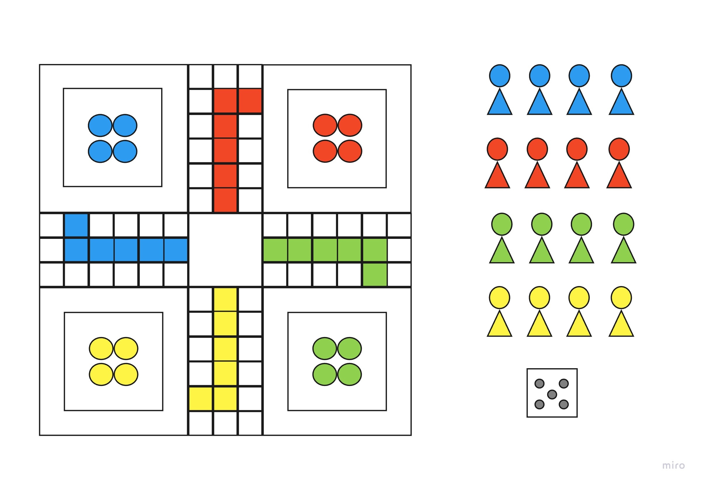

# 3D Ludo

## The Game

Ludo is a strategy board game for two to four players, Players race with their four tokens from start to
finish according to the rolls of a dice.

## Tech Being Used
* HTML
* CSS
* JavaScript
* three.js

## Wireframe

## Plan Breakdown
- [x] Day 1 - Create board model with Three.js 
- [x] Day 2 - Create characters and Dice model with Three.js
- [x] Day 3 - Implement interaction between models and work on pathways for characters
- [x] Day 4 - Complete pathways for characters movement
- [x] Day 5 - Tidy up project for presentation

## User Stories
- [x] As a user, I want to be able to interact with the characters
- [x] As a user, I want to be able to interact with the board to adjust the camera's view
- [x] As a user, I want to be able to interact with the dice

## MVP Checklist
- [x] Have a 3D game board 
- [x] Create 3D players
- [x] Movable players 
- [x] A 3D dice
- [ ] Board Rotation 
- [x] An end zone players work towards
- [ ] Animations for players movement
- [ ] A reset button to re-allign users view

## Future Goal
- [ ] Transform the concept of the game
